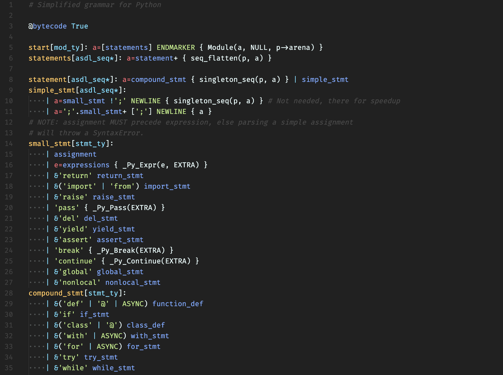

# pegen-peg README

Syntax highlighting for the PEG syntax, that the pegen project uses.

## Screenshot

Here's a screenshot of how the `data/simpy.gram` file of the pegen project looks like
when this extension is installed:

## Known Issues

Unfortunately, I haven't yet figured out a way to highlight the C expressions within actions.
